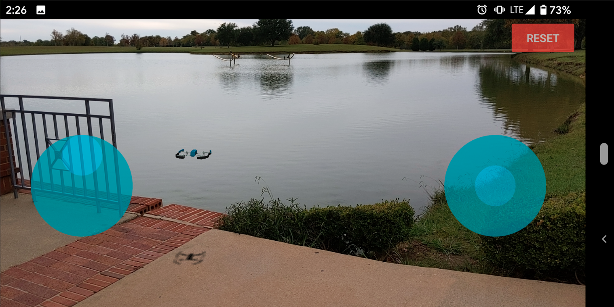
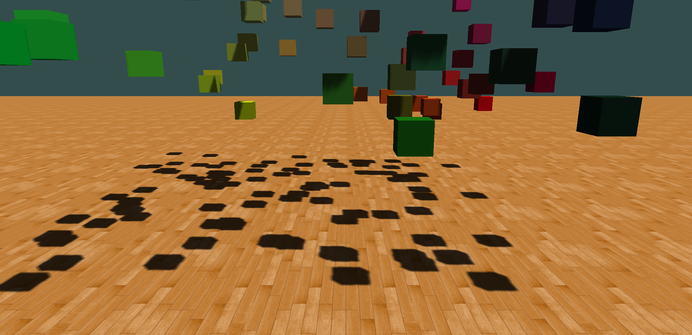

# AndroidGameEngine
This is a self-contained 3D game engine for Android written in native C++ complete with a 3D physics engine. It also integrates Google ARCore to allow making augmented reality games.

This game engine has been used to build games such as [AR Drone](https://play.google.com/store/apps/details?id=com.kstudios.ardrone&hl=en_US)

### Requirements/Dependencies
- C++14 compiler
- OpenGL ES 3.2
- Currently only works with 3DS files for 3D models.
- Min Android SDK version 24

### Installation
1. Install the latest version of [git](https://git-scm.com/downloads).
2. Install the latest version of [Android Studio](https://developer.android.com/studio/install).
3. Download the [NDK and Tools](https://developer.android.com/ndk/guides).
4. Clone this repository in Android Studio using the following steps:
	- File -> New -> Project from Version Control -> Git
	- Enter https://github.com/kyungminkim7/AndroidGameEngine.git into URL
	- Press "Clone"
	
### Project Setup
- To create your game, provide a subclass of the Game class in the cpp/ directory and make the necessary modifications to the CMakeLists.txt file in the same directory. 
- A game template is provided by the GameActivity.java, TestGame.h, and TestGame.cpp files which is what the Android Game Engine will build by default. Below is a screenshot of the default TestGame template.
  
- A game template for an augmented reality game is provided by the GameActivityAR.java, TestGameAR.h, and TestGameAR.cpp files. To build and run this template, make the following modifications to the project:
    1. AndroidManifest.xml: comment out the activity block for ".GameActivity" and uncomment the activity block for ".GameActivityAR"
    2. cpp/CMakeLists.txt: comment out the line for adding the library for the Testgame files and uncomment the line adding the library for the TestGameAR files
